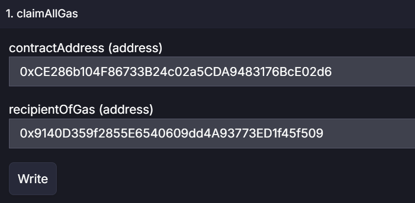

## Settings and Interactions with Blast Features

### Claim Gas & Native yeild
When a contract is deployed, if it is set to collect gas, an authorized address is assigned. For the test network, this is `Fenix Deployer`.
- The authority to manage native yield and gas claims can be transfer to another address.

#### Blast Interface

The contract from the Blast network offers the following functionalities for configuration changes:

- `configureGovernorOnBehalf(address _newGovernor, address contractAddress)` - Transfers management rights over a specific contract.
- `configureVoidGasOnBehalf(address contractAddress)` - Activates Void mode for gas on the contract.
- `configureClaimableGasOnBehalf(address contractAddress)` - Activates Claimable mode for gas on the contract.
- `configureVoidYieldOnBehalf(address contractAddress)` - Activates Void mode for ETH yield on the contract.
- `configureAutomaticYieldOnBehalf(address contractAddress)` - Activates Automatic mode for ETH yield on the contract.
- `configureContract(address contractAddress, YieldMode _yield, GasMode gasMode, address governor)` - A combined method to set all necessary parameters at once.

Methods for claiming gas and ETH yield from the contract (see https://docs.blast.io/building/guides/gas-fees):

- `claimYield(address contractAddress, address recipientOfYield, uint256 amount)` - Claims yield.
- `claimAllYield(address contractAddress, address recipientOfYield)` - Claims all yield.
- `claimAllGas(address contractAddress, address recipientOfGas)` - Claims all gas.
- `claimGasAtMinClaimRate(address contractAddress, address recipientOfGas, uint256 minClaimRateBips)` - Claims gas at a minimum claim rate.
- `claimMaxGas(address contractAddress, address recipientOfGas)` - Claims the maximum amount of gas.
- `claimGas(address contractAddress, address recipientOfGas, uint256 gasToClaim, uint256 gasSecondsToConsume)` - Claims a specified amount of gas.

Auxiliary methods for reading the current state:

- `readClaimableYield(address contractAddress)` - Reads the amount of claimable yield.
- `readYieldConfiguration(address contractAddress)` - Reads the yield configuration.
- `readGasParams(address contractAddress)` - Returns parameters related to gas, including ether seconds, ether balance, last updated time, and gas mode.

#### Examples

##### Claim Gas from Fenix Token Contract

- Test network address: `0xCE286b104F86733B24c02a5CDA9483176BcE02d6`
- Authorized address upon deployment: `0x9140D359f2855E6540609dd4A93773ED1f45f509`

To claim gas, you can interact through `testnet.blastscan.io` or use a script in the contract repository.

###### Using the Blast Testnet Website

1. Navigate to the Blast contract on the test network: [Blast Testnet Contract](https://testnet.blastscan.io/address/0x4300000000000000000000000000000000000002/contract/168587773/readContract)
2. In the "Read Contract" section, check the available gas for withdrawal.

3. In the "Write Contract" section, execute the withdrawal of all accumulated gas from the contract.

4. After the transaction is sent and processed, the accumulated ETH from gas will be transferred to the specified recipient's balance.

### Claim USDB/WETH yield from v2/v3 pairs
To support interactions and operations with USDB/WETH pairs, v2 pairs and v3 pools provide a set of methods through which an authorized address can configure and claim regarding rebasing tokens from the Blast system.

#### Rebasing Tokens Interface

The contract Pair (v2), AlgebraPool (v3)offers the following functionalities for configuration changes:

- `configure(address erc20Rebasing_, YieldMode mode_) ` - Configures the rebasing parameters of a specified ERC20 rebasing token in pair/pool

- `claim(address erc20Rebasing_, address recipient_, uint256 amount_)` - Claims rebasing tokens on behalf of the caller and transfers them to a specified recipient

#### Example
#### Setting Claimable Mode for WETH Token in v3 Pool

To set the rebasing token (for example, WETH) to Claimable mode in a v3 pool, follow these steps:

1. Determine the ERC20 rebasing token address for WETH that you want to configure.
2. Choose the `YieldMode` as `Claimable` for the token.
3. Use the `configure` function of the `AlgebraPool` (v3) contract, passing in the WETH token address and the desired `YieldMode`.
4. Execute the transaction, ensuring you have the necessary permissions to perform this action.

##### Claiming Accumulated WETH Yield in v3 Pool

To claim accumulated WETH yield from a v3 pool:

1. Identify the ERC20 rebasing token address for WETH from which you want to claim yield.
2. Specify the recipient address where the claimed WETH tokens should be transferred.
3. Determine the amount of WETH yield you wish to claim.
4. Use the `claim` function of the `AlgebraPool` (v3) contract, providing the WETH token address, recipient address, and the amount of yield to claim.
5. Execute the transaction with the necessary permissions to claim the yield.
